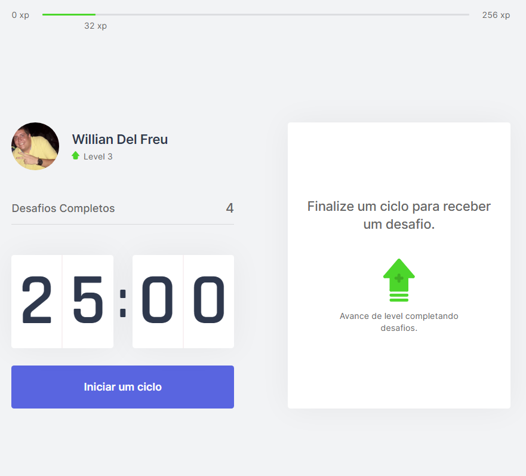

<h1 align="center">
    
</h1>

  <a href="#-tecnologias">Tecnologias</a>&nbsp;&nbsp;&nbsp;|&nbsp;&nbsp;&nbsp;
  <a href="#-projeto">Projeto</a>&nbsp;&nbsp;&nbsp;|&nbsp;&nbsp;&nbsp;
  <a href="#-layout">Layout</a>&nbsp;&nbsp;&nbsp;|&nbsp;&nbsp;&nbsp;
  <a href="#pré-requisitos">Pré-Requisitos</a>&nbsp;&nbsp;&nbsp;|&nbsp;&nbsp;&nbsp;
  <a href="#-como-executar">Como Executar</a>&nbsp;&nbsp;&nbsp;|&nbsp;&nbsp;&nbsp;
  <a href="#como-acessar">Como Acessar</a>

  

## 🚀 Tecnologias

Esse projeto foi desenvolvido com as seguintes tecnologias:

- [NextJS](https://nextjs.org/)
- [React](https://reactjs.org)
- [TypeScript](https://www.typescriptlang.org/)

## 💻 Projeto

O move.it é um app que une a técnica de Pomodoro com a realização de exercícios
físicos para quem passa muito tempo na frente do computador.

## 🔖 Layout

No link abaixo você encontra o layout do projeto web. Lembrando que você precisa
ter uma conta no [Figma](http://figma.com/) para acessá-lo.

- [Layout Web](https://www.figma.com/file/82Q6w8NvVvARJ3JgElqirT/Move.it-1.0-Copy?node-id=160%3A2761)

## Pré-requisitos

Antes de começar, você vai precisar ter instalado em sua máquina as seguintes
ferramentas:

- [Git](https://git-scm.com)
- [Node](https://nodejs.org/en/)

## 🚀 Como executar

- Clone o repositório
- Instale as dependências com `yarn` ou `npm`
- Inicie o servidor com `yarn dev` ou `npm run dev`

Agora você pode acessar [`localhost:3000`](http://localhost:3000) do seu
navegador.

## Como Acessar

- Deploy realizado na vercel

Você pode acessar a aplicação [Acesse aqui](https://moveit-williandf.vercel.app/){:target="blank" rel="noopener"}.
